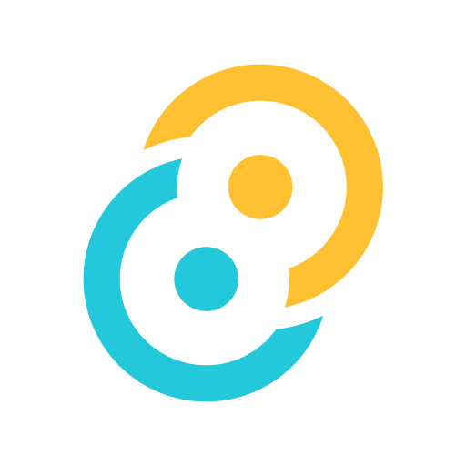
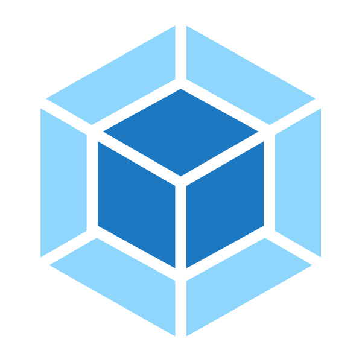

### 初次见面 👋🏻

* 我的名字是樊晨煜，花名启煜。
* 欢迎访问 [我的个人网站](https://kira.host)
* 是一个前端小菜鸟 🐣 对计算机充满热情
* 就读于 ~~**世界一流大学**~~ 山东大学的软件学院，目前已拿到蚂蚁金服的 offer 🐜
* 空闲时我会做什么：`Random("写代码", "玩电脑游戏", "看动漫")`
* 信仰 **共产主义** **☭**
* 期待与你成为朋友 🤟🏻

### Hi there! 👋🏻
* This is **`Kira`** ✨ A freshman in front-end programming 🐣
* Majoring in the **Software Engine of Shandong University** 🏔︎ Working in the **Ant Group** 🐜
* I like `Random("coding", "playing computer games", "watching bangumi")` while free
* Believing in **Communism** **☭**
* Looking forward to becoming friends with you 🤟🏻

### Stats 💯

<a href="https://reactjs.org/"><code></code></a>
<a href="https://www.typescriptlang.org/"><code></code></a>
<a href="https://www.electronjs.org/l"><code></code></a>
<a href="https://www.rust-lang.org/"><code></code></a>
<a href="https://tauri.app/"><code></code></a>
<a href="https://lesscss.org/"><code></code></a>
<a href="https://webpack.js.org/"><code></code></a>
<a href="https://vitejs.dev/"><code></code></a>

  

    
  

  

    
  

  

    
  

### My Projects

### Github Activity

### Little Wish

  

